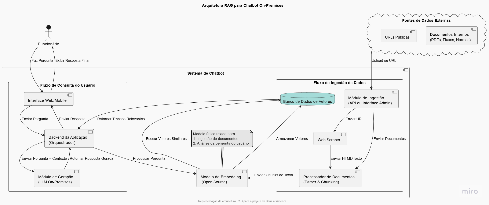

# Documento Principal do Projeto

O Bank of America é uma das principais instituições financeiras do mundo, atendendo indivíduos, pequenas e médias empresas, grandes corporações e governos com uma gama completa de produtos e serviços bancários, de gestão de investimentos e outros produtos e serviços financeiros e de gestão de risco.
Atualmente, processos e procedimentos internos do Operations Brazil estão documentados em portais e repositórios internos, mas a busca por essas informações é pouco intuitiva e, muitas vezes, ineficiente. Os funcionários perdem tempo procurando manuais, fluxos e normas, além de não haver um mecanismo integrado que ofereça respostas atualizadas, adaptadas ao contexto de cada área e às regras de Compliance e Info Security.
O objetivo é de desenvolver uma solução que permita a centralização e atualização de informações relacionadas a processos, acessos, treinamentos, normas e diretrizes que devem ser considerados por funcionários, permitindo a integração de diversas fontes e tipos de conteúdo. A solução deve envolver também um Chatbot corporativo que, com aplicação de tecnologias on-premises, permita a recuperação das informações previamente centralizadas e atualizadas por meio de consultas realizadas em linguagem natural. 

## (Sprint 1) Finalização do documento de plano de projeto

O cronograma busca garantir entregas contínuas, permitindo ajustes rápidos e melhorias progressivas. Este plano de projeto descreve o desenvolvimento ao longo das próximas semanas, definindo informações gerais do projeto, acordos entre aluno e parceiro, objetivos do projeto, escopo do projeto - backlog do produto, roadmap e cronograma macro do projeto, premissas e restrições, time do projeto, gestão de mudanças, gestão de riscos, gestão da comunicação e melhoria contínua.
Ao final, espera-se um chatbot on-premise capaz de compreender uma pergunta feita pelo usuário em linguagem natural, e buscar por semelhança em uma base de dados respostas que aproximem a pergunta do usuário do elemento contido nesse banco de dados.

Nesse momento, o plano de projeto está acessível em https://github.com/Inteli-College/2025-2A-T22-G92-INTERNO/blob/main/docs/sprint%201/Plano%20de%20projeto%20Inteli%20-%20Bank%20of%20America.pdf

## (Sprint 2) Arquitetura da Solução

A fim de possibilitar o desenvolvimento da solução proposta para o Bank of America é necessária a confecção de uma arquitetura da solução que leve em consideração todo o fluxo de trabalho para esquematizar, planejar e executar o projeto com base em um plano pré-definido. Com base nessa premissa, será fornecida a seguir a arquitetura da solução com a posterior explicação de cada parte idealizada durante a Sprint 2.


Imagem 1: Arquitetura da Solução

### Fontes de Dados Externas

Esses são os locais de onde a informação será extraída para construir a base de conhecimento. A arquitetura foi projetada para lidar com diferentes formatos de forma flexível.

Documentos Internos (PDFs, Fluxos, Normas) representam os manuais e procedimentos que atualmente estão em portais e repositórios internos, e que são difíceis de encontrar. A solução os centralizará, tornando a busca mais eficiente dentro do Bank of America.

URLs Públicas também fazem parte da arquitetura uma vez que esse projeto não contempla o acesso a dados internos ao banco, então os dados serão recuperados de URLs públicas. Logo, será importante a extração de conteúdo de páginas como regulamentações utilizando Web Scraper.

### Fluxo de Ingestão de Dados

Este é o processo pelo qual os documentos e URLs são lidos, processados e preparados para serem usados pelo chatbot. É a etapa que constrói a "memória" do sistema.

O Módulo de Ingestão atua como a porta de entrada para novos dados. Pode ser uma API para upload de arquivos ou uma interface de administração onde um usuário pode colar URLs e iniciar o processo de extração.

O Web Scraper é o componente responsável por navegar e extrair o conteúdo de URLs. Ele converte o HTML das páginas web em texto simples, pronto para ser processado.

O Processador de Documentos recebe o texto dos arquivos e do Web Scraper. Sua função é crucial para:

- Parsing: Extrai o texto do documento (como de um PDF).

- Chunking: Divide o texto em pequenos trechos semanticamente coesos. Essa divisão garante que o modelo de busca encontre informações mais precisas, pois o contexto de cada pedaço é mais focado e igual entre as todas as partes.

### Modelo de Embedding

Este é um dos componentes centrais da arquitetura RAG. Ele é compartilhado porque a mesma "lógica de linguagem" é usada em dois momentos diferentes: converter a pergunta do usuário e converter o dado para que ele seja armazenado no banco de dados vetorial.

A Função do Modelo de Embedding é transformar o texto em vetores numéricos. Um vetor é uma representação matemática do significado de uma palavra ou frase.

Como dito anteriormente, sua utilização se dá em 2 momentos distintos:

- No fluxo de ingestão, ele converte os trechos dos documentos em vetores para que possam ser armazenados no banco de dados.

- No fluxo de consulta, ele converte a pergunta do usuário no mesmo formato de vetor para que a busca por similaridade possa ser realizada.

### Banco de Dados Vetorial

Esse é o coração da base de conhecimento. Ele não armazena o texto em si, mas os vetores gerados pelo Modelo de Embedding.

O Qdrant, banco de dados vetorial escolhido, é um tipo de banco de dados especializado em armazenar e buscar vetores com base na sua similaridade. Quando o chatbot precisa de informação, ele não busca por palavras-chave, mas por vetores que tenham um "significado" próximo ao da pergunta do usuário.

A vantagem desse tipo de banco se dá pela maior eficiência do que uma busca tradicional por palavras-chave, pois permite que o chatbot encontre respostas para perguntas formuladas de diferentes maneiras, mesmo que as palavras exatas não estejam no documento.

Estamos utilizando o Docker para fazer o armazenamento, um exemplo de salvamento bem-sucedido:


### Fluxo de Consulta do Usuário

É a parte do sistema que interage diretamente com o funcionário, do momento da pergunta até a exibição da resposta.

A Interface Web/Mobile é o local no qual o usuário interage. Deve ser "mobile friendly" e intuitiva, permitindo que o funcionário faça perguntas em linguagem natural.

O Backend da Aplicação (Orquestrador) é o cérebro da arquitetura. Ele gerencia todo o processo: recebe a pergunta do UI, envia-a para o Modelo de Embedding para análise, faz a consulta no Banco de Dados Vetorial, e, por fim, envia o contexto para o LLM.

O Módulo de Geração (LLM On-Premises) é o modelo de linguagem open source que gera a resposta. Ele recebe a pergunta do usuário e os trechos de documentos mais relevantes, e com base nesse contexto cria uma resposta coesa e fácil de entender. É aqui que as respostas "adaptadas ao contexto de cada área" e as "regras de Compliance" são consideradas. Como a solução deve ser on-premises, ele é executado localmente, dentro do ambiente controlado.

### Funcionário

O funcionário é o usuário final que se beneficia da solução. O chatbot visa aumentar a eficiência operacional, facilitando o acesso à informação e disseminando conhecimento de forma ágil entre os funcionários do Bank of America.

## (Sprint 3) Definição de algoritmos e soluções

### Introdução
Nessa sprint foi feita uma comparação entre diferentes modelos de embeddings aplicáveis ao desenvolvimento do chatbots para o Bank of America, focados em organização e recuperação de documentos.  
A escolha do modelo de embedding impacta diretamente na qualidade da busca semântica, na privacidade dos dados e no custo da solução.  
Além disso, a escolha do modelo de embedding impacta a escolha do modelo de chunking, uma vez que o modelo de embedding consome os dados após o modelo de chunking, portanto o output do modelo de chunking deve ser compatível com o input do modelo de embedding.  

O objetivo é fornecer uma visão clara dos prós, contras e características técnicas de cada modelo, de forma a justificar o modelo escolhido.

---

### 1. Comparação de Prós e Contras do Modelo de Embedding

| Modelo | Prós | Contras |
|--------|------|---------|
| **OpenAI Embeddings** (text-embedding-3-small / large) | - Suporte a **chunks grandes** (até 8k tokens)<br>- Muito bons em entendimento semântico<br>- Multilíngue (bom em PT/EN)<br>- Facilidade de integração via API | - Não fazem chunking automático (necessário implementar)<br>- Dependência de API externa (custo + privacidade) |
| **Sentence-BERT (SBERT)** | - Open-source (roda localmente, privacidade garantida)<br>- Bons em trabalhar com **chunks curtos**<br>- Muitas variações otimizadas<br>- Possibilidade de fine-tuning nos dados da empresa | - Limite de contexto menor (~512 tokens)<br>- Não fazem chunking automático<br>- Exigem mais infraestrutura de hardware |
| **Cohere Embeddings** | - Suporte a **chunks longos** (até 4k tokens)<br>- Alta performance em busca semântica<br>- API simples e bem documentada | - Não fazem chunking automático<br>- Dependência de API externa (custo + privacidade) |
| **E5 / GTE (General Text Embeddings)** | - Muito bons em recuperação de informação baseada em chunks<br>- Performance competitiva em benchmarks<br>- Open-source (roda localmente, sem custo variável) | - Limite de contexto menor (~512–1024 tokens)<br>- Não fazem chunking automático<br>- Setup mais técnico que APIs comerciais |

---

### 2. Comparação Técnica

| Modelo | Limite de Tokens por Chunk | Privacidade | Custo | Uso Recomendado |
|--------|-----------------------------|-------------|-------|-----------------|
| **OpenAI Embeddings** | ~8k | Baixa (dados vão para API externa) | Pago por uso | Protótipos rápidos, quando simplicidade e qualidade são prioridade |
| **Sentence-BERT (SBERT)** | ~512 | Alta (roda localmente) | Gratuito (infra própria) | Produção com dados sensíveis, bom para bases médias |
| **Cohere Embeddings** | ~4k | Baixa (API externa) | Pago por uso | Alternativa ao OpenAI, bom equilíbrio entre custo e performance |
| **E5 / GTE** | ~512–1024 | Alta (roda localmente) | Gratuito (infra própria) | Produção em larga escala, quando custo e privacidade são cruciais |

### 3. Justificativa da Escolha do SBERT

Dentro da arquitetura RAG proposta, o modelo SBERT (Sentence-BERT) se mostra o mais adequado porque pode ser executado totalmente on-premises, preservando a privacidade dos dados corporativos e eliminando a dependência de serviços externos. Ele gera embeddings de alta qualidade tanto para a indexação de documentos quanto para a análise das perguntas dos usuários, permitindo a busca semântica eficiente no banco de vetores. Além disso, integra-se bem ao fluxo de parser e chunking previsto na arquitetura, já que trabalha de forma eficaz com entradas de até aproximadamente 512 tokens. Por ser open-source e rodar localmente, o SBERT não gera custo variável por requisição, o que traz vantagens de escalabilidade no ambiente do Bank of America, com grande volume de documentos e consultas. Outro ponto importante é a possibilidade de fine-tuning com dados específicos da organização, como normas, manuais e fluxos internos, o que aumenta a precisão das respostas e torna o modelo mais alinhado ao domínio da empresa. Dessa forma, o SBERT atende aos requisitos de privacidade, qualidade semântica, eficiência no processamento e flexibilidade de adaptação, mostrando-se a escolha adequada para a arquitetura.

### 4. Comparação de Prós e Contras do Modelo de Chunking

| Modelo | Prós | Contras |
|--------|------|---------|
| **Fixed-size** | - Simples de implementar<br>- Garante limite fixo de tokens<br>- Rápido e eficiente | - Pode cortar frases/parágrafos<br>- Contexto pode ficar quebrado |
| **Sliding window** | - Mantém continuidade entre chunks<br>- Reduz perda de contexto em cortes<br>- Útil em textos técnicos | - Aumenta número de chunks<br>- Gera redundância e maior custo de busca |
| **By paragraph/sentence** | - Preserva estrutura semântica<br>- Melhor coerência dentro do chunk | - Pode gerar chunks maiores que 512 tokens<br>- Produz tamanhos desbalanceados |
| **Recursive chunking** | - Preserva semântica sempre que possível<br>- Garante limite de tokens respeitado<br>- Balanceia eficiência e qualidade | - Implementação mais complexa<br>- Pode ser mais lento que fixed-size |

---

### 5. Comparação Técnica

| Modelo | Limite de Tokens | Preservação Semântica | Custo Computacional | Uso Recomendado |
|--------|------------------|------------------------|---------------------|-----------------|
| **Fixed-size** | Até 512 | Baixa | Baixo | Protótipos simples, alta velocidade |
| **Sliding window** | Até 512 | Média | Médio | Textos que exigem contexto contínuo |
| **By paragraph/sentence** | Variável (truncado a 512) | Alta | Médio | Documentos bem estruturados |
| **Recursive chunking** | Até 512 | Alta | Médio-Alto | Produção, quando precisão é prioridade |

---

### 6. Justificativa da Escolha do Fixed Size

Dentro da arquitetura RAG proposta, o método de chunking baseado em blocos de tamanho fixo se mostra uma escolha adequada porque é simples de implementar, garante que cada parte do documento respeite o limite de 512 tokens exigido pelo modelo de embedding SBERT e mantém a eficiência do fluxo de indexação e consulta. Esse método permite dividir documentos longos em segmentos consistentes, evitando falhas no processamento e assegurando compatibilidade com a geração de embeddings. É de fácil implementação e baixo custo computacional, mas mantém a robustez necessária para um chatbot de consulta de documentos e, por isso, é adequado para o projeto.


### 7. Comparação entre Bancos de Dados Vetoriais

| Banco Vetorial | Prós | Contras |
|----------------|------|---------|
| **Qdrant** | - Open source<br>- Suporte nativo a filtros híbridos (vetorial ou estruturado)<br>- Fácil de rodar on-premises<br>- Alta performance em busca aproximada | - Otimização de recursos em nuvem |
| **Pinecone** | - Totalmente gerenciado na nuvem<br>- Alta escalabilidade<br>- Bom suporte comercial | - Não possui versão on-premises<br>- Custos elevados em grande escala<br>- Dependência de provedor externo |
| **Weaviate** | - Open source<br>- API GraphQL avançada<br>- Suporte a multimodalidade (texto, imagem, etc.) | - Mais complexo de configurar<br>- Requer maior curva de aprendizado |
| **Milvus** | - Open source<br>- Muito utilizado em grandes volumes (bilhões de vetores)<br>- Forte suporte da comunidade | - Mais pesado para rodar em ambientes menores<br>- Curva de aprendizado maior que Qdrant |

---

O Qdrant foi escolhido na sprint passada porque atende bem ao requisito de execução on-premises, além da robustez ofercida na busca por dados. Aqui foi apresentada uma comparação do Qdrant com outros possíveis banco de dados, a fim de demonstrar comparativamente porque ele é adequado para o projeto.


### 8. Referências

[1] N. Reimers and I. Gurevych, “Sentence-BERT: Sentence Embeddings using Siamese BERT-Networks,” *Proceedings of the 2019 Conference on Empirical Methods in Natural Language Processing*, 2019. [Online]. Available: https://arxiv.org/abs/1908.10084  

[2] OpenAI, “Text Embedding Models,” *OpenAI Documentation*, 2024. [Online]. Available: https://platform.openai.com/docs/guides/embeddings  

[3] Cohere, “Embeddings,” *Cohere Documentation*, 2024. [Online]. Available: https://docs.cohere.com/docs/embeddings  

[4] J. Wang, Y. Kuo, and D. Zhou, “Text Embeddings by Weakly-Supervised Contrastive Pre-training,” *arXiv preprint arXiv:2212.03533*, 2022. [Online]. Available: https://arxiv.org/abs/2212.03533  

[5] Hugging Face, “SentenceTransformers Documentation,” *Hugging Face*, 2024. [Online]. Available: https://www.sbert.net/  

[6] LangChain, “Text Splitters,” *LangChain Documentation*, 2024. [Online]. Available: https://python.langchain.com/docs/modules/data_connection/document_transformers/text_splitters/  

## (Sprint 4) Vetorização e salvamento dos dados no servidor local

### Guia de execução - Servidor Local (Qdrant)

### 1. Pré-requisitos

- Python 3.10+
- Docker
- Git

Rodar o Qdrant localmente com o Docker:<br>
  docker run -p 6333:6333 -p 6334:6334 qdrant/qdrant<br>
O container vem configurado para persistir memória e é acessado via API pela porta usada no código, número 6333
Para facilitar a visualização dos vetores salvos no Qdrant, é possível acessar a seguinte URL para manusear os dados na interface nativa do Qdrant:
  http://localhost:6333/dashboard#/collections/documents

### 2. Instalação das Dependências

```bash
pip install -r requirements.txt
```

### 3. Rodando o Banco Vetorial (Qdrant) Localmente:

```bash
docker run -d -p 6333:6333 -p 6334:6334 -v qdrant_storage:/qdrant/storage qdrant/qdrant
```

```bash
$env:QDRANT_HOST="127.0.0.1"
$env:QDRANT_PORT="6333"
```


Acesse o localhost para verificar: http://localhost:6333/

### 4. Servidor Remoto

Se o Qdrant estiver em um servidor remoto:

No Terminal:

```bash
$env:QDRANT_HOST = "XX.XXX.X.XX"   # IP do servidor remoto
$env:QDRANT_PORT = "6333"          # Porta do Qdrant
```
## (Sprint 5) Aperfeiçoamento e leitura da vetorização por uma API

### 1. Rodando a API de Ingestão (FastAPI)

```Bash
uvicorn src.api.main:app --reload
```


Acesse no navegador: http://127.0.0.1:8000

Você deve ver:


Verificar utilizando no powershell:
```bash
Invoke-WebRequest -Uri "http://127.0.0.1:8000/ingest/test" -Method GET
```


### Realizando a Ingestão de Dados

Com URLs - Exemplo do site do Banco Central Brasileiro

No powershell
```bash
$urls = @{
    "urls" = @(
        "https://www.bcb.gov.br/estabilidadefinanceira/exibenormativo?tipo=Resolu%C3%A7%C3%A3o%20CMN&numero=5237",
        "https://www.bcb.gov.br/estabilidadefinanceira/exibenormativo?tipo=Resolu%C3%A7%C3%A3o%20CMN&numero=5238",
        "https://www.bcb.gov.br/estabilidadefinanceira/exibenormativo?tipo=Resolu%C3%A7%C3%A3o%20BCB&numero=453"
    )
}

Invoke-WebRequest -Uri "http://127.0.0.1:8000/ingest" `
    -Method POST `
    -Headers @{ "Content-Type" = "application/json" } `
    -Body ($urls | ConvertTo-Json -Depth 5)
```

Resultado


É possivel verificar se foi salvo no localhost
http://localhost:6333/collections/documents/points/#idDoItem (1,2,3, etc...)


### 2. Rodando a API de PDF (upload-pdf)

```Bash
uvicorn src.api.main:app --reload
```

Acesse no navegador: http://127.0.0.1:8000/docs

Você deve ver:


Procure pelo endpoint Post \upload-pdf e em seguida aperte "Try it ouy":


Selecione o PDF desejado e execute:


então você poderá ver o resultado, deve ver algo como:


